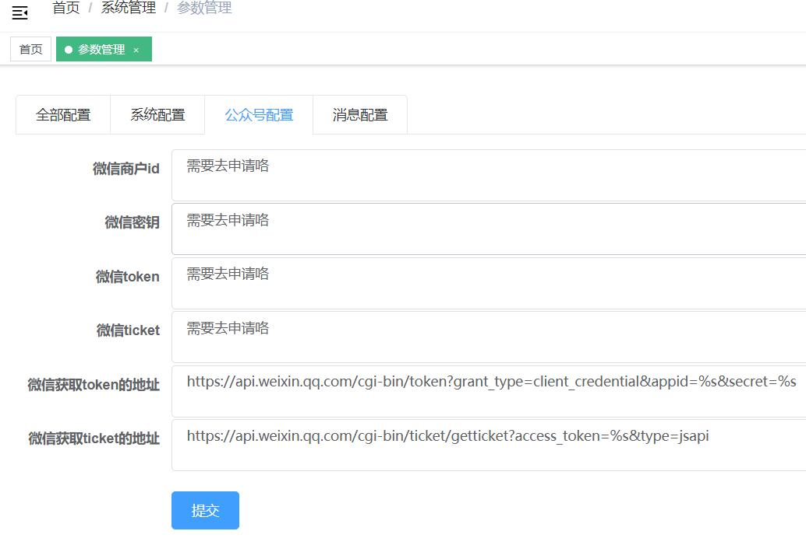

# 对接微信
本章节从获取微信token，获取微信信息等几方面来说明系统如何和微信做对接。

## 基础配置
目前系统针对微信对接提供了如下的参数配置，后期如果有需要可以自行添加
```
- 微信商户id:   	        weixin.app.id
- 微信密钥:     	        weixin.app.secret
- 微信获取token的地址:	    weixin.access.token.url
- 微信获取ticket的地址:   weixin.js.api.ticket.url
- 微信token:	            weixin.access.token
- 微信ticket:	        weixin.js.api.ticket
```

- 上面参数中前四个需要事先配置好，具体参数代表的意思不再赘述，不明白的请自行查阅微信官方文档或者google。
- 本系统提供了一个定时任务：UpdateWeixinTokenJob 来定时获取微信token和ticket，获取成功后会存放到参数表中。
- 另外建议微信相关配置参数的key值都以"weixin"开头，这样可以复用后台管理中参数管理的分组功能；如：



## 获取用户信息
linjiashop-mobile项目提供了用户登录后获取微信用户基本信息（微信昵称、头像、openid）的功能
src/view/user/user.js中当用户成功获取基本信息后，会紧接着获取微信相关信息。
部分代码示例：
```javascript
init() {
    userApi.getUserInfo().then(response => {
        const url = window.location.href
        if(url.indexOf('localhost')>-1 || url.indexOf('127.0.0.1')>-1) {
            console.log('开发环境不获取openid')
        }else{
            const userAgent = window.navigator.userAgent.toLowerCase()
            //使用微信访问本系统的时候获取微信openid，否则不获取
            if(userAgent.indexOf('micromessenger'>-1)) {
                this.processOpenid();
            }
        }
    }).catch((err) => {
        this.$router.replace({path:'login',query:{redirect:'user'}})
    })
}
```
- 后台具体获取逻辑可以从上述代码进行调试跟进，继而查看和调整。

## 微信模板消息（未完成）

## 微信支付（未完成）


